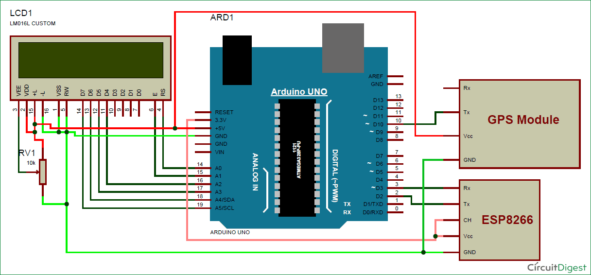

# Vehicle Tracker on Google Maps using ESP8266 and GPS
## Problem Statement
Designing a device which can be attached to a vehicle which will send location coordinates over WiFi to a local server in the form of a link which can be opened to view the location on Google Maps. This device has to be designed such that it can be used to track insti buses.
## Description
In this project, the location coordinates are sent to the Local Server and you just need to open a ‘webpage’ on your computer or mobile, where you will find a Link to Google Maps with your Vehicles Location Coordinates. When you click on that link, it takes you on Google Maps, showing your vehicles location. In this Vehicle Tracking System using Google Maps, GPS Module is used for getting the Location Coordinates, Wi-Fi module to keep send data to computer or mobile over Wi-Fi and Arduino is used to make GPS and Wi-Fi communicate eith each other.
## Ideation
* To track the vehicle, we need to find the coordinates of vehicle by using GPS module. GPS module communicates continuously with the satellite for getting coordinates. Then we need to send these coordinates from GPS to the Arduino by using UART. And then the Arduino extracts the required data from received data by GPS.

* Here Tx pin of GPS module is directly connected to digital pin number 10 of Arduino. By using Software Serial Library here, serial communication is allowed on pin 10 and 11, and made them Rx and Tx respectively and left the Rx pin of GPS Module open.
* Wi-Fi module ESP8266’s Vcc and GND pins are directly connected to 3.3V and GND of Arduino and CH_PD is also connected with 3.3V. Tx and Rx pins of ESP8266 are directly connected to pin 2 and 3 of Arduino. Software Serial Library is also used here to allow serial communication on pin 2 and 3 of Arduino.
* In this project, we have selected 9600 baud rate for all the UART communications.
